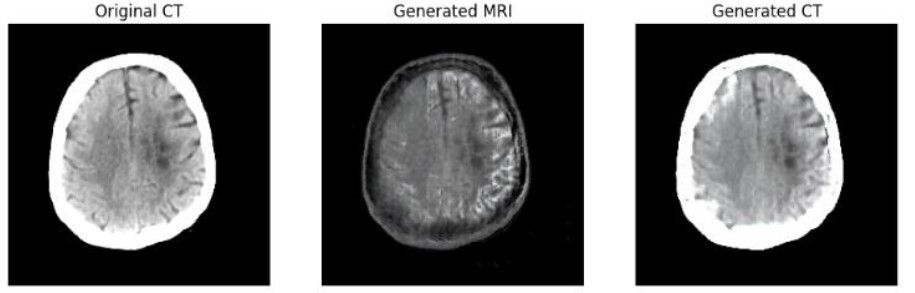
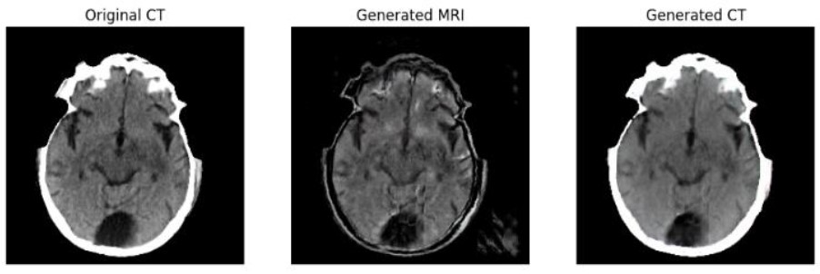

# Medical Image Translation using CycleGAN with Brain Tumor Detection

## Introduction

Medical Image Translation using CycleGAN with Brain Tumor Detection is a project aimed at translating CT scan images into corresponding MRI-like images while also incorporating brain tumor detection. This project leverages the power of CycleGAN, a deep learning architecture, to bridge the gap between different imaging modalities and enhance diagnostic accessibility in medical imaging.

## Methodology

The methodology involves the following steps:

1. **Data Preprocessing:** 
   - CT and MRI images are preprocessed to ensure uniformity in size and format.
   - Data augmentation techniques may be applied to increase dataset diversity.

2. **Model Architecture:**
   - CycleGAN architecture is utilized for unpaired image translation.
   - Conditional GANs are employed with cyclic connections between generators.
   - Generators are conditioned with concatenation of alternate unpaired patches from input and target images.
   - Discriminators validate the translated imagery using minimax function.
   - Adaptive dictionaries are incorporated into generators to reduce possible degradation.

3. **Training:**
   - The model is trained on a dataset consisting of CT and MRI image pairs.
   - Loss functions, including adversarial, non-adversarial, forward-backward cyclic, and identity losses, are utilized to minimize variance.

4. **Evaluation:**
   - Translated MRI-like images are evaluated for anatomical fidelity and diagnostic accuracy.
   - Brain tumor detection is performed on generated MRI images.

## Results

The results of the project demonstrate:

- High fidelity translation of CT images into MRI-like images.
- Successful brain tumor detection on translated MRI images.

## Further Research Directions

1. **Data Diversity:**
   - Expand the training dataset to include more diverse anatomical regions and pathologies.
   - Explore translation capabilities across other imaging modalities such as PET, X-ray, etc.

2. **Model Optimization:**
   - Investigate techniques to improve model performance and reduce computational requirements.

# References

[1] Isola, P. et al. (2018) Image-to-image translation with conditional adversarial networks, arXiv.org. Available at: https://arxiv.org/abs/1611.07004

[2] Rai, S., Bhatt, J. S., & Patra, S. K. (2023, November 4). A strictly bounded deep network for unpaired cyclic translation of medical images. arXiv.org. https://arxiv.org/abs/2311.02480

[3] Dataset: DARREN2020. CT and MRI brain scans, https://www.kaggle.com/datasets/darren2020/ct-to-mri-cgan 

## Outputs

For detailed explanation about the project, refer this <a href="https://drive.google.com/file/d/1CBdmjwFiErOoD0QMEAYwL4hOol4Cx9BH/view?usp=sharing">report</a>.
